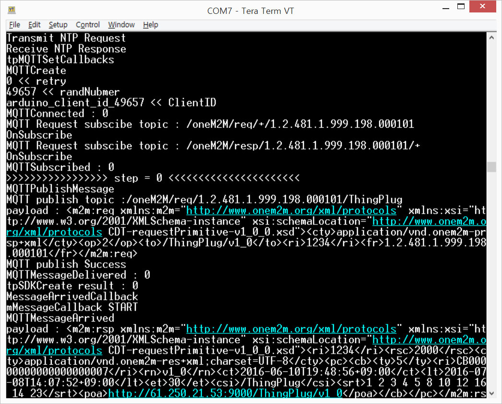
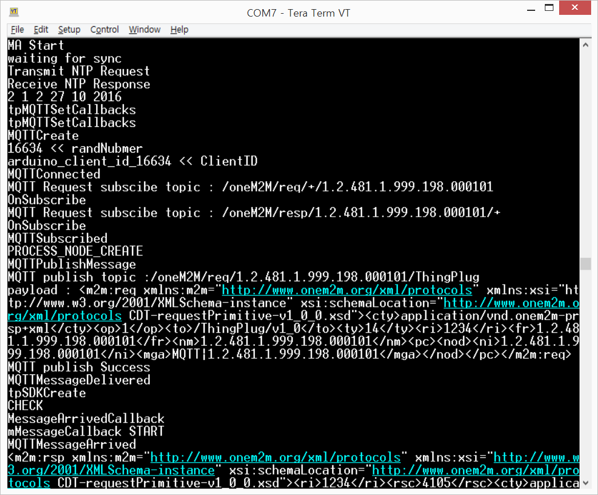

ARDUINO
===

지원 사양
---
1. 최소 동작 환경
	* CPU : 32MHz
	* RAM : 24KB
	* Flash memory : 126KB
2. 테스트 환경
	+ Arduino 101 (USA ONLY) & Genuino 101 (OUTSIDE USA) 
		+ CPU : 32MHz Intel Curie
		+ RAM : 24KB
		+ Flash memory : 196KB
3. Ethernet board
	+ Arduino Ethernet Shield R3 	
	

Source Tree
---
* [Source](https://github.com/SKT-ThingPlug/thingplug-device-sdk-C/tree/master/Arduino)
+ __Arduino__ (project root)
	+ __examples__
		+ __ThingPlug_oneM2M_SDK__ (device SDK)
			+ ThingPlug_oneM2M_SDK.ino ( Arduino Sketch File )
			+ __src__
			  + __MA__ (ManagementAgent)
			  + __SRA__ (ServiceReadyAgent)
			  + __SMA__ (SensorManagementAgent)
		+ __SDKVerification__ (SDK example)
			+ SDKVerfication.ino (sdk test source)
			+ Configuration.h (config file)
	+ __src__ (oneM2M SDK source)
		+ __MQTT__ (Arduino MQTT Library)
		+ __include__ (header files)
		+ __net__ (MQTT interface source)
		+ __oneM2M_V1__ (oneM2M v1 sdk source)
		+ __oneM2M_V1_12__ (oneM2M v1.12 sdk source)
	+ __libraries__ (Essential Arduino Libraries)
		+ __Time__ (Arduino Time library)

Project build
===

IDE 설정
---
1. IDE homepage
	+ https://www.arduino.cc/
	
2. Download & Install
	
3. Installing Additional Arduino Libraries
    + https://www.arduino.cc/en/Guide/Libraries
    + 라이브러리 설치에 대한 자세한 설명은 공식사이트를 참고한다.

SDK 설치하기
---
1. oneM2M 라이브러리를 다운로드 받는다.
2. 압축을 해제한다.
3. IDE가 설치되면, 각 피씨환경의 홈 폴더에 Arduino 폴더가 생긴다.
4. Arduino/libraries 에 oneM2M SDK 폴더를 복사한다.
5. oneM2M/libraries/[essential libraries]를 Arduino/libraries 폴더로 복사한다.
6. SDK 설치가 완료되었다.

SDK 빌드하기
---
1. Arduino IDE를 실행시킨다.
2. 상단 메뉴에 스케치->컴파일을 선택한다.
3. 상단 메뉴에 툴->보드, 포트를 Genuino 101/연결된 포트로 설정한다.
4. 상단 메뉴에 스케치-> 업로드를 선택한다.
5. 성공시 아래 콘솔창에 메시지가 출력된다
```
스케치는 프로그램 저장 공간 81,688 바이트(52%)를 사용. 최대 155,648 바이트.
Starting download script...
SUCCESS: Sketch will execute in about 5 seconds.
```

SDK 테스트 코드 실행하기
---
1. Arduino IDE를 실행한다.
2. 상단 메뉴에 파일->예제->oneM2M->SDKVerification 선택한다.
3. 상단 메뉴에 스케치->컴파일을 선택한다.
4. 상단 메뉴에 툴->보드, 포트를 Genuino 101/연결된 포트로 설정한다.
5. 상단 메뉴에 스케치-> 업로드를 선택한다.
6. 업로드가 완료되면 상단 메뉴에 툴->시리얼 모니터를 선택한다.
7. oneM2M 동작 테스트가 시작된다.
8. 결과 (Teraterm screenshot)



ThingPlug_oneM2M_SDK 실행하기
---
1. Arduino IDE를 실행한다.
2. 상단 메뉴에 파일->예제->oneM2M->ThingPlug_oneM2M_SDK 선택한다.
3. 상단 메뉴에 스케치->컴파일을 선택한다.
4. 상단 메뉴에 툴->보드, 포트를 Genuino 101/연결된 포트로 설정한다.
5. 상단 메뉴에 스케치-> 업로드를 선택한다.
6. 업로드가 완료되면 상단 메뉴에 툴->시리얼 모니터를 선택한다.
7. oneM2M 동작 테스트가 시작된다.
8. 결과 (Teraterm screenshot)



Copyright (c) 2016 SK Telecom Co., Ltd. All Rights Reserved.
