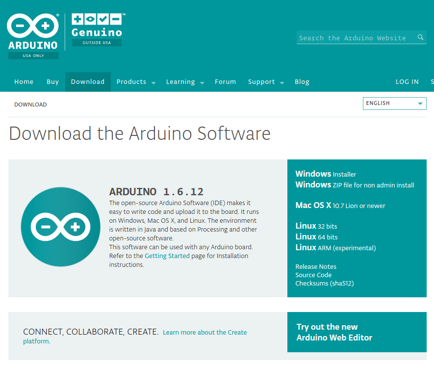

ThingPlug 1.5 C SDK for ARDUINO
===

지원 사양
---
1. 최소 동작 환경
	* CPU : 32MHz
	* RAM : 24KB
	* Flash memory : 126KB
2. 테스트 환경
	+ Arduino 101 (USA ONLY) & Genuino 101 (OUTSIDE USA) 
		+ CPU : 32MHz Intel Curie
		+ RAM : 24KB
		+ Flash memory : 196KB
3. Ethernet board
	+ Arduino Ethernet Shield R3 	
	

Source Tree
---
+ __Arduino__ (project root)
	+ __ThingPlug_oneM2M_SDK__ (device SDK)
		+ ThingPlug_oneM2M_SDK.ino ( Arduino Sketch File )
		+ __src__
		  + __MA__ (ManagementAgent)
		  + __SRA__ (ServiceReadyAgent)
		  + __SMA__ (SensorManagementAgent)
	+ __libraries__ (Essential Arduino Libraries)
		+ __oneM2M__
			+ __src__ (oneM2M SDK source)
				+ __MQTT__ (Arduino MQTT Library)
				+ __include__ (header files)
				+ __net__ (MQTT interface source)
				+ __oneM2M_V1_14__ (oneM2M v1.14 SDK source)
		+ __Time__ (Arduino Time library)

Project build
===

IDE 설정
---
1. IDE homepage
	+ https://www.arduino.cc/
	
2. Download & Install
	
3. Installing Additional Arduino Libraries
    + https://www.arduino.cc/en/Guide/Libraries
    + 라이브러리 설치에 대한 자세한 설명은 공식사이트를 참고한다.

Copyright (c) 2017 SK Telecom Co., Ltd. All Rights Reserved.
