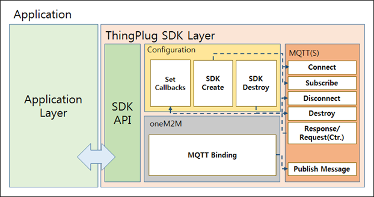

ThingPlug oneM2M SDK
===
본 챕터는 SKT ThingPlug oneM2M SDK 구조와 API 및 사용법에 대하여 서술한다.

Architect
---

SDK Source Tree
---
+ __oneM2M__ (ThingPlug oneM2M SDK root folder)
	+ __docs__ (Developer guide & API documentation)
	+ __samples__ (Samples including makefiles for build)
	+ __lib__ (external libraries - paho, TLS, )
	+ __include__ (Header files of the ThingPlug oneM2M SDK)
	+ __src__ (Source files of the ThingPlug oneM2M SDK)
		+ __oneM2M_V1__ (Source files of the ThingPlug oneM2M v1)
		+ __oneM2M_V1_12__ (Source files of the ThingPlug oneM2M v1.12)
		+ __net__ (Source files of the MQTTS)
			
Description
---
Directory | Description
------------ | -------------
oneM2M | ThingPlug oneM2M SDK 루트 폴더
docs | 개발 가이드와 API document 폴더
samples |	SDK 를 이용한 샘플 Application들 폴더
lib | 외부 라이브러리나 소스들 폴더
include | 동작에 필요한 header 파일들 폴더
src | 전체 소스 폴더
oneM2M_V1 | ThingPlug oneM2M v1 관련 소스 폴더
oneM2M_V1_12 | ThingPlug oneM2M v1.12 관련 소스 폴더
net | MQTT/TLS 관련 소스들 폴더

Library
---
MQTT TLS 지원을 위하여 라이브러리를 사용한다.

지원 환경 | TLS 지원 | MQTT 라이브러리 | TLS 라이브러리
------------ | ------------- | ------------- | -------------
__ARM/Linux__ | __O__ | paho | OpenSSL(to be installed.)
__ARDUINO__ | __X__ | paho |
__mbed__ |	__O__ | paho | mbed TLS
__FreeRTOS__ |	__O__ | paho | mbed TLS

* [paho Homepage](https://eclipse.org/paho/)
* [OpenSSL Homepage](https://www.openssl.org/)
* [mbedTLS Homepage](https://tls.mbed.org/)

API Documentation
---
* [Download](https://github.com/SKT-ThingPlug/thingplug-device-middleware/raw/master/SDK/linux/docs/ThingPlug_oneM2M_SDK_API-20161025.pdf)

Samples
---
SDK를 사용한 예제들은 다음과 같다.

* __SDKVerification.c__ or __SDKVerification.ino__ : oneM2M API 전체를 검증한다.

* __ThingPlug_oneM2M_SDK.c__ or __ThingPlug_oneM2M_SDK.ino__ : 좀 더 실질적인 사용예제로 등록작업 위주로 되어있다.
	+ __MA__ (미들웨어의 ManagementAgent 역할)
	+ __SRA__ (미들웨어의 SensorManagementAgent 역할)
	+ __SMA__ (미들웨어의 ServiceReadyAgent 역할)

* __MA__ 
	* 디바이스 등록부터 해지까지 다음 Sequence Diagram 구조로 동작한다.

* __SRA__ & __SMA__
	* [SRA](SDK_SRA.md) 
	* [SMA](SDK_SMA.md)

Supported Devices
---
지원 가능한 디바이스별 자세한 내용은 다음과 같다.

* [ARM/Linux](linux)
* [ARDUINO](Arduino)
* [mbed](mbed)
* [FreeRTOS](FreeRTOS)

Copyright (c) 2016 SK Telecom Co., Ltd. All Rights Reserved.