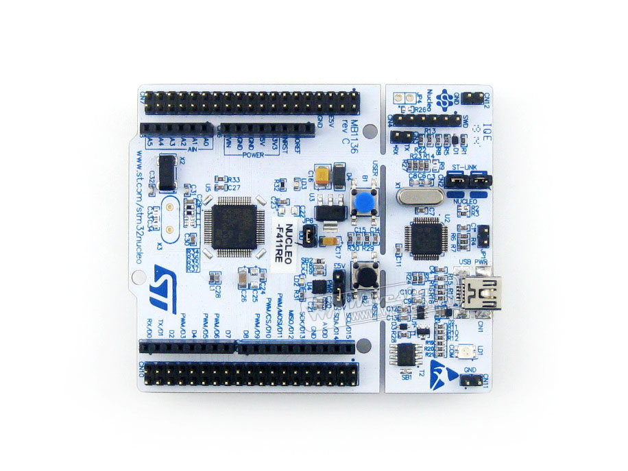
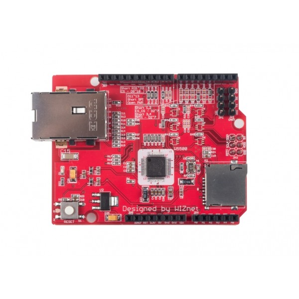
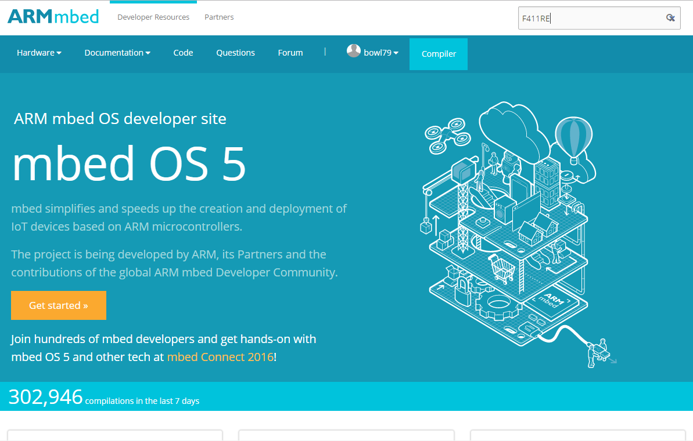
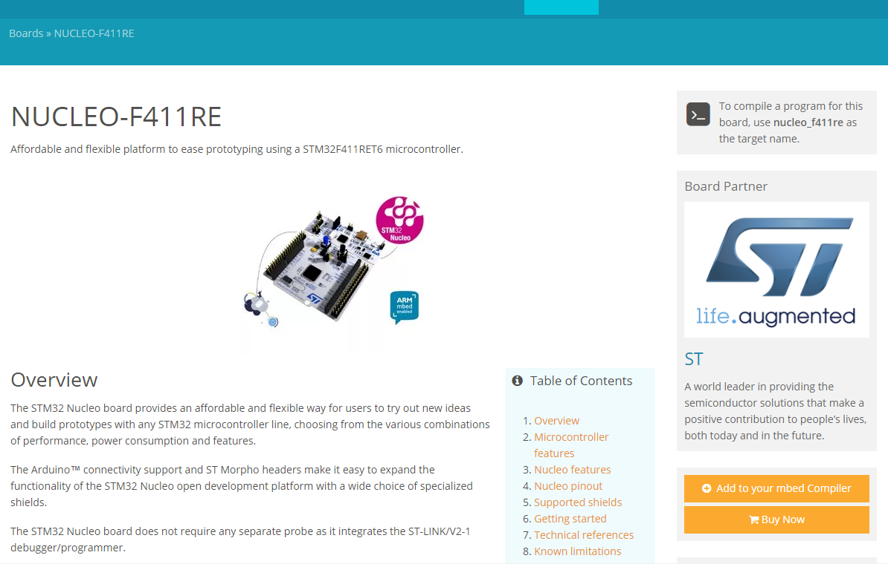
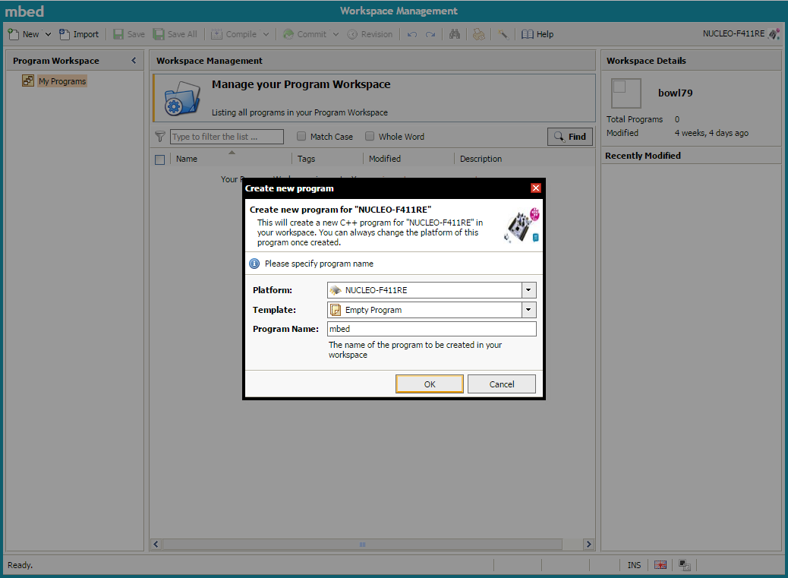
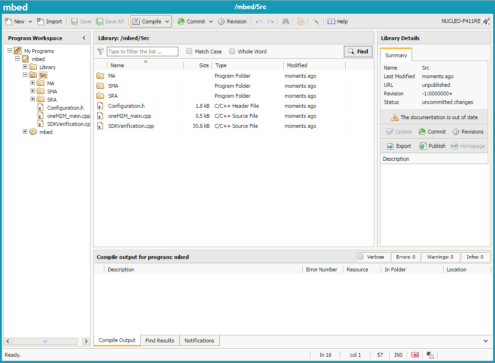
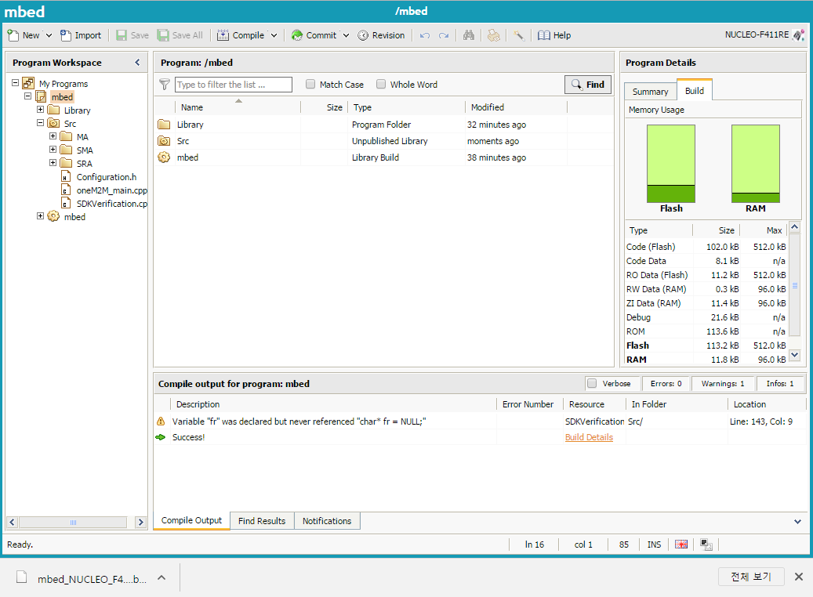
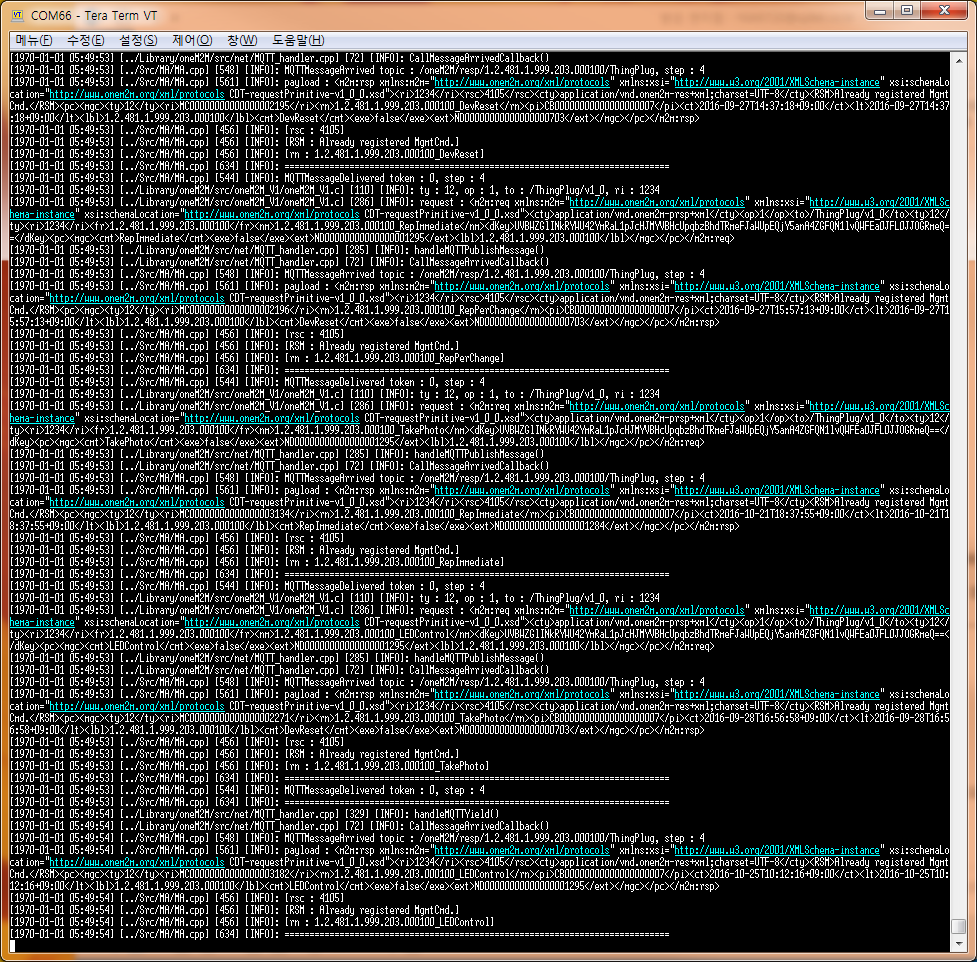

mbed (+TLS)
===

동작 환경
---
1. 최소 동작 환경
	+ CPU : 50MHz 이상
	+ RAM : 64KB 이상
	+ Flash memory : 256KB 이상
2. 테스트 환경
 1. Main board
	+ STMicroelectronics Nucleo-64 F411RE (or L152RE)
	
		+ CPU : 100MHz ARM 32-bit Cortex-M4 with FPU
		+ RAM : 128KB
		+ Flash memory : 512KB
 2. Ethernet board
	+ WIZnet W5500
    

Source Tree
---
* [Source](https://github.com/SKT-ThingPlug/thingplug-device-sdk-C/tree/master/mbed)
+ __mbed__ (project root)
	+ __Library__ (libraries)
		+ __mbedtls_2_3_0__ (mbed TLS library)
			+ __include__ (library headers)
			+ __library__ (TLS library source)
		+ __MQTT__ (mqtt library)
			+ __Extend__ (mqtt library 확장, TLS library 및 WIZnet socket 연결)
			+ __FP__
			+ __MQTTPacket__ (MQTT packet 처리 source)
		+ __oneM2M__ (oneM2M library)
			+ __include__ (library headers)
			+ __src__ (oneM2M library source)
				+ __net__ (MQTT handler)
				+ __oneM2M_V1__ (ThingPlug oneM2M v1 API)
				+ __oneM2M_V1_12__ (ThingPlug oneM2M v1.12 API)
		+ __WIZnet_Library__ (WIZnet library)
			+ __WIZnetInterface__ (WIZnet board interface)
				+ __DHCPClient__ (DHCP 통신 처리)
				+ __DNSClient__ (DNS 통신 처리)
				+ __Socket__ (socket source)
				+ __WIZnet__ (WIZnet driver)
	+ __mbed__ (mbed source)
		+ __TARGET_NUCLEO_F411RE__ (Nucleo F411RE driver)
	+ __Src__ (test sample)
		+ __MA__ (ManagementAgent)
		+ __SMA__ (SensorManagementAgent)
		+ __SRA__ (ServiceReadyAgent)

Project build
===

IDE 설정
---
1. IDE homepage
	+ https://developer.mbed.org
2. 회원 가입 및 로그인
3. 단말 조회
	+ 오른쪽 상단의 입력상자에 __'F411RE'__ 입력
	
	+ 검색 결과의 'NUCLEO-F411RE | mbed' 선택
	+ 우측의 'Add to your mbed Compiler' 클릭
	
	+ 버튼이 'Open mbed Compiler'로 바뀌면 클릭
4. Project 생성
	+ Template을 'Empty Program'으로 선택하고 Program Name에 project명 입력
	

Library import
---
1. mbed
 1. Library import
	+ Import Wizard의 Library tab에서 'mbed' 검색
	+ Author가 'mbed official'인 mbed library import
2. project root에 'Library' directory 생성
3. WIZnet_Library
 1. Library import
	+ Import Wizard의 Library tab에서 'wiznet' 검색
	+ Author가 'Team WIZnet'인 WIZnet_Library library를 Library directory 하위에 import
 2. MQTT library와 중복되는 code 수정
	+ 'WIZnet' directory의 W5500.h 파일의 enum Command의 각 항목 앞에 __CMD___를 붙임 (ex. OPEN -> CMD_OPEN)
	+ 위의 enum Command를 사용하는 code 부분 모두 수정
	+ 또는 namespace를 사용하여 아래와 같이 수정하여 사용
	```
	namespace w5500_Command {
		enum Command {
		    OPEN      = 0x01,
		    LISTEN    = 0x02,
		    CONNECT   = 0x04,
		    DISCON    = 0x08,
		    CLOSE     = 0x10,
		    SEND      = 0x20,
		    SEND_MAC  = 0x21, 
		    SEND_KEEP = 0x22,
		    RECV      = 0x40,

		};
	}
	using namespace w5500_Command;
	```
4. MQTT
 1. Library import
	+ Import Wizard의 Library tab에서 'mqtt' 검색
	+ Author가 'Team MQTT'인 MQTT library를 Library directory 하위에 import
 2. Extend code 추가
	+ Source Tree의 'Library/MQTT/Extend' directory를 zip 파일로 압축
	+ Import Wizard의 Upload tab에서 화면 아래의 '파일 선택' 버튼을 눌러 zip 파일 선택 후 'Import!' 버튼 클릭
	+ import 된 Extend directory를 MQTT directory의 하위로 이동
5. mbedtls
 1. Library download
	+ https://tls.mbed.org/
 2. Library import
	+ mbedtls library에서 'include', 'library' directory를 'mbedtls_2_3_0.zip' 파일로 압축
	+ Import Wizard의 Upload tab에서 화면 아래의 '파일 선택' 버튼을 눌러 zip 파일 선택 후 'Import!' 버튼 클릭
	+ import 된 library 파일을 Library directory 하위에 위치시킴
 3. config.h 변경
	+ Source Tree의 '/Library/mbedtls_2_3_0/SSL_Config.h' 파일을 mbedtls library directory 아래의 include directory에 있는 config.h 파일에 덮어씀
6. oneM2M
 1. Library import
	+ Source Tree의 '/Library/oneM2M' directory를 zip 파일로 압축
	+ Import Wizard의 Upload tab에서 화면 아래의 '파일 선택' 버튼을 눌러 zip 파일 선택 후 'Import!' 버튼 클릭
	+ import 된 library 파일을 Library directory 하위에 위치시킴
 2. oneM2MConfig.h 수정
	+ __DEBUG_ENABLE__ : define 됐을 경우 debug log 활성화 됨
	+ __IMPORT_TLS_LIB__ : define 됐을 경우 TLS library가 포함됨
	+ __MAC_ADDRESS__ : 사용할 mac address 지정(다른 device와 겹치면 안됨)

Sample code import
---
1. Code import
	+ Source Tree의 'Src' directory를 zip 파일로 압축
	+ Import Wizard의 Upload tab에서 화면 아래의 '파일 선택' 버튼을 눌러 zip 파일 선택 후 'Import!' 버튼 클릭
	+ import 된 sample 파일을 project root에 위치시킴
2. '/Src/Configuration.h' 수정
	+ __ONEM2M_V1_12__ : define 됐을 경우 oneM2M v1.12가 활성화 됨
	+ __MQTT_ENABLE_SERVER_CERT_AUTH__ : 0(Normal socket 사용), 1(TLS socket 사용)
	+ __ACCOUNT_USER__ : ThingPlug 계정의 ID
	+ __ACCOUNT_PASSWORD__ : ThingPlug 계정의 사용자 인증키
	+ __ONEM2M_NODEID__ : ThingPlug 계정에 등록할 Device ID
3. '/Src/ThingPlug_oneM2M_SDK.cpp' 수정
 1. serial port speed 변경
	+ SDKVerification.cpp 파일에서 main() 함수의 pc.baud(115200); 수정
 2. 실행 대상 변경
	1. SDK verification을 실행할 경우
		+ main() function 내의 SDKVerificationMain(); 활성화
	2. MA를 실행할 경우
		+ main() function 내의 MARun(); 활성화

Build & Run
---
1. Build
	+ 화면 상단의 'Compile' 버튼 클릭
	
2. Run
	+ build 후 다운로드 된 .bin 파일을 윈도우 탐색기에서 'NODE_F411RE'로 연결된 device drive에 복사
	
3. 실행 로그 확인
	+ Serial 통신 프로그램(ex. Putty, Tera Term 등)을 사용해서 프로그램 로그 확인
	(※ sample code의 ThingPlug_oneM2M_SDK.cpp 파일에서 지정한 speed와 맞춰 환경을 설정해야 글자가 깨져 보이지 않음)
	

Copyright (c) 2016 SK Telecom Co., Ltd. All Rights Reserved.
