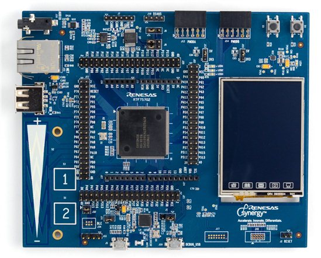
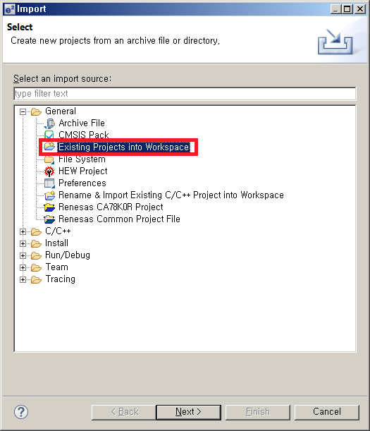
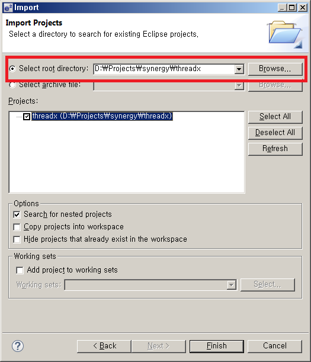
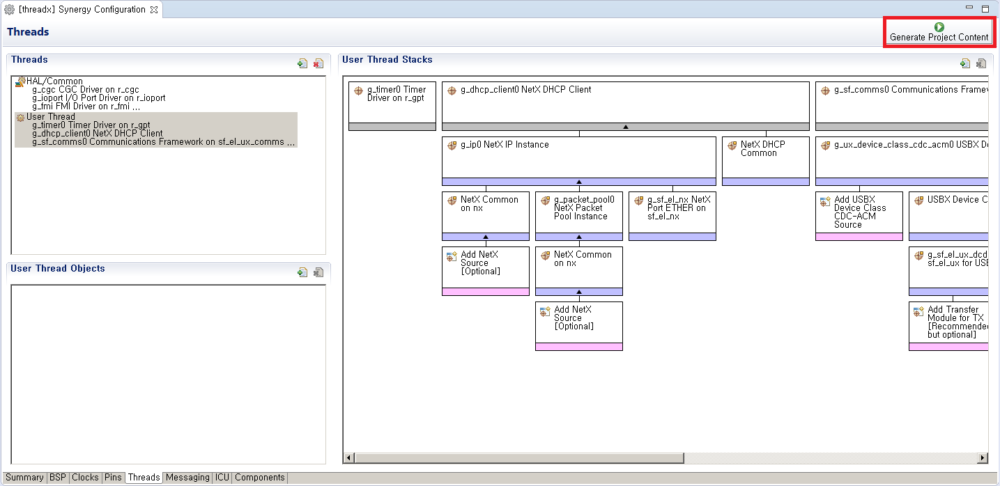
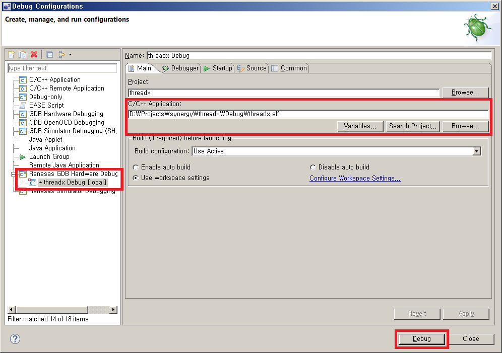

# ThreadX
## PC 시스템의 최소 요건
+ 운영 시스템 : Windows® 7 (32비트, 64비트) 이상
+ 프로세서 : Intel® Core™ 패밀리 프로세서, 2.0 GHz 이상 (또는 동등 프로세서)
+ 메모리 용량 : 최소 8 GB
+ 하드디스크 용량 : 최소 250 GB
+ 디스플레이 : 해상도 1024 x 768 이상, 65,536 컬러 이상
+ 인터페이스	: USB 2.0
## 지원사양
	1. Footprint
  		+ CPU : 50MHz 이상
		+ RAM : 64KB 이상
		+ Flash memory : 256KB 이상
	2. Main Board
		+ S7G2 Renesas Synergy™ S7 MCU 32-Bit ARM® Cortex®-M4 Embedded Evaluation Board
		https://www.renesas.com/ko-kr/products/software-tools/boards-and-kits/renesas-synergy-kits/renesas-synergy-sk-s7g2.html 

## Source Tree
+ threadx (project root)
	+ Debug ( elf 파일 및 컴파일 결과물 )
	+ script ( ld 파일 )
	+ src (FreeRTOS 및 WIZnet driver configuration headers)
		+ Configuration.h ( ThingPlug 설정 파일 )
		+ mbedtls ( tls library )
		+ MQTT ( mqtt library )
		+ oneM2M ( oneM2M library )
			+ net (MQTT handler)
			+ Versions (ThingPlug oneM2M v1.14 API)
		+ sample ( Device Middleware lite version )
			+ MA (ManagementAgent)
			+ SMA (SensorManagementAgent)
			+ SRA (ServiceReadyAgent)
		+ synergy_gen ( auto generated source code )
	+ synergy ( board & driver source )
	+ synergy_cfg ( board & driver configuration source )
# Project build
## IDE Setting & Build & Run
1. https://synergygallery.renesas.com -> 회원가입 -> 개발툴 -> e2studio ISDE, Renesas SSC -> 다운로드
2. 압축 해제 후 e2studio, SSC 순서로 설치
3. e2studio 실행
4. File->Import->General->Existing Projects into Workspace 선택하고 Select root directory 에서 소스 추가

5. e2studio의 추가된 프로젝트에서 configuration.xml을 클릭한다.
6. Generate Project Content를 클릭한다.

7. Configuration.h 설정파일을 ThingPlug 계정 및 기기 정보에 맞춰 수정한다.
8. Project->Build Project를 선택하여 Build를 실행한다.
9. Run->Debug Configurations 클릭하고 새창에서 Renesas GDB Hardware Debugging을 더블클릭하여 신규 Debug Configuration을 생성한다.

10. C/C++ Application: 항목에 Build 완료된 threadx.elf 파일을 지정한다.
11. Run->Resume 선택하여, 프로그램을 시작한다.
